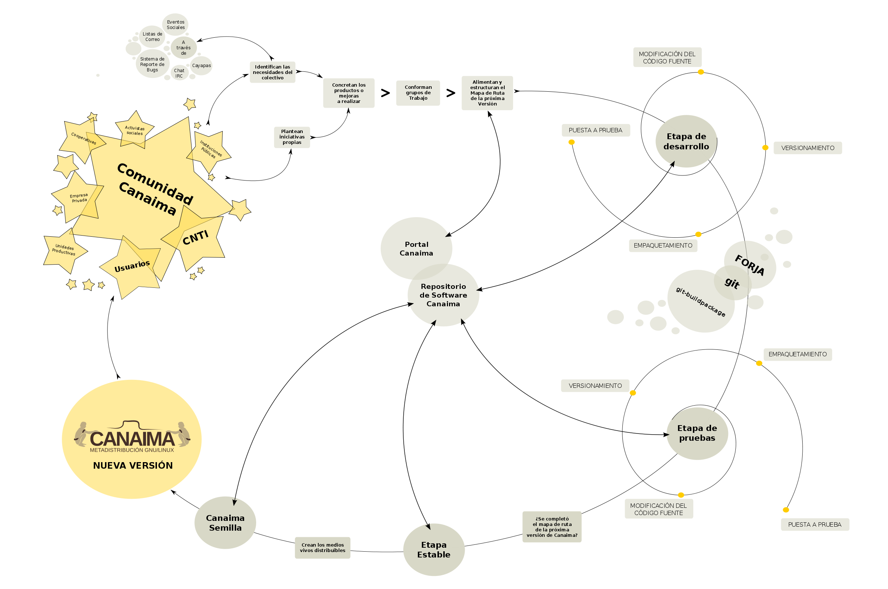
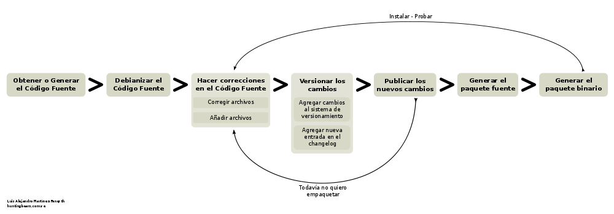

================================
**Manual para el Desarrollador**
================================

.. Lista de links en éste documento
.. _CNTI: http://www.cnti.gob.ve/
.. _Cayapa: http://cayapa.canaima.softwarelibre.gob.ve/
.. _desarrolladores: http://listas.canaima.softwarelibre.gob.ve/cgi-bin/mailman/listinfo/desarrolladores
.. _discusion: http://listas.canaima.softwarelibre.gob.ve/cgi-bin/mailman/listinfo/discusion
.. _soporte: http://listas.canaima.softwarelibre.gob.ve/cgi-bin/mailman/listinfo/soporte
.. _servicios: http://listas.canaima.softwarelibre.gob.ve/cgi-bin/mailman/listinfo/servicios
.. _Listas de Correo: http://listas.canaima.softwarelibre.gob.ve/cgi-bin/mailman/listinfo
.. _Sistema de Reporte de Bugs: http://proyectos.canaima.softwarelibre.gob.ve/canaima/query
.. _Chat IRC: http://canaima.softwarelibre.gob.ve/soporte/soporte/chat-irc
.. _Mapa de ruta de la próxima versión de Canaima: http://canaima.softwarelibre.gob.ve/descargas/canaima-dvdnvivo/mapa-de-ruta
.. _forja.softwarelibre.gob.ve: http://forja.softwarelibre.gob.ve/
.. _Gitorious: http://gitorious.com/
.. _Github: http://github.com/
.. _Guía de referencia del Desarrollador: http://wiki.canaima.softwarelibre.gob.ve/wiki/Guía_de_Referencia_para_el_Desarrollador

Es bien sabido que Canaima GNU/Linux es una de las distribuciones de Software Libre más importantes de Venezuela. Actualmente se incluye en más de 880 mil portátiles del proyecto Canaima Educativo, ha sido descargado más de 120 mil veces del portal oficial y se planea extender el Proyecto a toda la Administración Pública Nacional.

Sin embargo, la popularidad no lo es todo. Detrás de Canaima GNU/Linux existe un ciclo de desarrollo bastante particular, propio de la dinámica socio-tecnológica en que está envuelto. Éste documento describirá la metodología mediante la cual el colectivo asociado a la Metadistribución, participa en los procesos socio-productivos y de desarrollo que impulsan la generación de Nuevas versiones de Canaima y sustentan su plataforma tecnológica.

**Sobre el Ciclo de Desarrollo de Canaima**
===========================================

Podemos decir que básicamente el ciclo de desarrollo de Canaima sigue un flujo natural de los acontecimientos tal cual se reseñan en el esquema inferior.

¿Quienes son los actores?
-------------------------

La comunidad canaima está conformada por un gran número de personas que tienen intereses comunes y que comparten un mismo espacio virtual conformado por una serie de herramientas y servicios condensados en una plataforma pública. Éstos actores provienen de distintas organizaciones y colectivos, a saber: el CNTI_, Instituciones Públicas en general, Unidades Productivas, Cooperativas, Empresas Privadas, Activistas Sociales y Usuarios en general.

Éste conjunto de personas poseen una dinámica propia, característica de sus realidades particulares; sin embargo, es posible diferenciar un ciclo que se ejecuta cada vez que se publica una nueva versión de Canaima GNU/Linux.

Cocinando una nueva versión de Canaima GNU/Linux
------------------------------------------------

En teoría, una versión de Canaima es publicada cada ~6 meses en sincronía con la Cayapa_. Para que ésto se cumpla, ciertos hitos deben ser alcanzados.

**La primera meta es realizar un producto**. ¿Quien puede realizar un producto para Canaima GNU/Linux? Cualquiera puede hacerlo, sin embargo te recomendamos ciertas cosas que te ayudarán a hacerlo con mayor calidad y eficiencia:

- Aprende a empaquetar con git-buildpackage (más abajo).
- Participa en la lista de correo desarrolladores_, discusion_ y soporte_.
- Usa Canaima para todo.
- Infórmate acerca de las conclusiones a las que se llegaron en la última Cayapa.

**¿Que producto hago?** Existen dos formas de actuar en éste dilema: **determinar y seleccionar una necesidad actual del Proyecto Canaima**, a través de los medios de comunicación destinados a ello (`Listas de Correo`_, `Sistema de Reporte de Bugs`_, `Chat IRC`_, Cayapa_ y otros eventos sociales) o **seleccionar un proyecto de iniciativa propia**. Una vez concretado el producto que vas a hacer, cómo lo vas a hacer y en que tiempo, anúncialo, comunícalo a la comunidad y ¡Manos a la obra!

Es importante añadir tu proyecto en el `Mapa de ruta de la próxima versión de Canaima`_.

Etapas de Desarrollo
--------------------

Las etapas de desarrollo iniciales de un producto son locales e involucran casi cualquier elemento que al desarrollador se le ocurra, en fin, es producto de un proceso creativo que se parece mucho a un proceso artístico. Cuando tu proyecto tenga una estructura más o menos definida, es hora de versionarlo con git e ir publicando tu código; en ésta etapa entra en juego forja.softwarelibre.gob.ve_.

“La forja” es un espacio público donde puedes alojar proyectos de software libre de una forma práctica y gratuita, bajo la plataforma de Canaima GNU/Linux y usando un repositorio git. Crea un proyecto y ve publicando tu código ahí.

A medida que vas madurando y depurando tu código, es buena idea ir también trabajando en la debianización del paquete fuente para finalmente generar el paquete binario con git-buildpackage.  Haz sucesivas pruebas de empaquetado con tu proyecto, y cuando llegues a un nivel en donde sea usable, puedes solicitar a través de la lista de correo desarrolladores_ permisos suficientes en los servidores de la Plataforma Canaima para subir tus paquetes a la rama de desarrollo. En tu solicitud debes incluir:

   1. Nombre del Paquete (Completo).
   2. Descripción de su utilidad.
   3. Dependencias con otros paquetes.
   4. Dirección del código fuente.
   5. Direccción del paquete .deb tal cual va a ser incluído en los repositorios.

Una vez otorgados los permisos, puedes subir cuantas versiones consideres, con la frecuencia que necesites. Está demás decir que cualquier intento de violar la privacidad del usuario o de inyectar código malicioso resultará en una severa penalización.

Cuando sientas que haz llegado a una versión estable de tu paquete, es hora de incluirlo en la rama pruebas, para que el colectivo lo use y ofrezca su retroalimentación. El procedimiento es similar al anterior, realiza la petición de inclusión del paquete en la rama pruebas incluyendo la siguiente información:

   1. Nombre del Paquete (Completo).
   2. Descripción de su utilidad.
   3. Dependencias con otros paquetes.
   4. Dirección del código fuente.
   5. Direccción del paquete .deb tal cual va a ser incluído en los repositorios.

Finalmente, cuando todos los objetivos establecidos en el mapa de ruta se hayan cumplido, todos los paquetes de la rama pruebas serán pasados a estable, generando así una nueva versión de Canaima. Los medios vivos instalables serán generados a través de canaima-semilla.

**Versionando con GIT**
=======================

GIT es una herramienta de desarrollo muy útil. Con ella cualquier persona podrá manejar de una manera sencilla y práctica el versionamiento de su trabajo.

¿Por qué necesito versionamiento?
---------------------------------

Muchas veces pasa que queremos devolver uno o varios cambios en archivos que ya guardamos y cerramos y nos encontramos con que no tenemos forma de hacerlo.

Con el control de versiones o versionamiento, tenemos la facilidad de gestionar los diferentes cambios que se hacen en el contenido, configuración y propiedades de los archivos de un determinado proyecto. Ésta característica nos permite devolver cambios hacia versiones anteriores, además de facilitar el acceso y distribución de código fuente mediante la utilización de repositorios locales o remotos.

¿Y por qué GIT?
---------------

GIT es una herramienta de versionamiento creada por Linus Torvalds, desarrollador del Kernel Linux. Entre sus beneficios con respecto a otros sistemas de versionamiento tenemos que es un sistema distribuido que permite el trabajo con repositorios locales que luego pueden ser fusionados con el repositorio principal.

¿Cómo uso GIT?
--------------

Lo primero que se debe hacer es instalarlo. Es muy fácil, -como es de costumbre en Linux-, escribimos lo siguiente en una consola con permisos de superusuario::

	aptitude install git-core

Para comenzar a trabajar, accedemos al directorio principal de nuestro proyecto y ejecutamos los siguientes comandos::

	git init

Con ésto inicializamos el versionamiento en el directorio raíz del proyecto::

	git add .

Añadimos todos los archivos del proyecto a ser versionados a nuestro repositorio local::

	git commit -a -m "Mensaje descriptivo de los cambios"

Realizamos la carga de la primera versión de nuestro proyecto.

Uso de un repositorio en línea
------------------------------

Existen varios lugares en internet que brindan servicio gratuito para almacenar proyectos de Software Libre bajo la plataforma GIT. Éstos sitios proveen un repositorio dinámico que permite un versionamiento descentralizado, es decir, que varias personas podrían hacer carga y descarga de datos en nuestro proyecto mediante permisología definida y fusión inteligente, facilitando así el trabajo colaborativo entre diferentes personas.

Uno de éstos sitios es Gitorious_ (también está Github_). Para poder hacer uso de los servicios de Gitorious (o Github), es necesario que tanto el creador del Proyecto como sus colaboradores se registren. Además, cada cuenta creada debe asignarsele la (o las) llave(s) SSH de los equipos autorizados para publicar o descargar contenido. Para conocer nuestra llave SSH utilizamos el comando ssh-keygen; el resultado de ésta consulta debe ser ingresado en el apartado “Manage SSH Keys”, de la página de tu perfil en gitorious.org.

Comenzando a trabajar
---------------------

Inicialmente, debemos agregar el repositorio remoto, que para el caso de gitorious, se indica en la página principal del proyecto. Para ello, creamos un alias o nombre para la dirección del repositorio, de la siguiente forma::

	git remote add <alias> <dirección>

Por ejemplo::

	git remote add origin git@gitorious.org:miproyecto/mainline.git

Seguidamente, el comando para ejecutar la carga de archivos versionados al servidor es el siguiente (recordar hacer git commit -a antes)::

	git push <alias> <rama>

En donde rama indica la rama del ciclo de desarrollo al que pertenece esta carga de archivos. La principal es master. Por ejemplo::

	git push origin master

Programación Colaborativa
-------------------------

Otras personas pueden bajar los archivos fuente “clonando” tu repositorio. Para hacerlo creamos una carpeta, digamos “proyecto” y dentro de ella ejecutamos::

	git clone <dirección>

Por ejemplo::

	git clone http://git.gitorious.org/miproyecto/mainline.git

Esto descargará los archivos de la rama principal (master) a la carpeta donde nos encontremos. Una vez en poder de los archivos fuente, podremos realizar modificaciones y subirlos al repositorio en línea con el comando git push, descrito anteriormente (siempre y cuando tengamos la permisología necesaria del creador en gitorious.org). Ésta actividad podemos repetirla cuantas veces sea necesario.

Es recomendable actualizar los archivos fuente cada vez que se vayan a realizar cambios para evitar discordancias.

**Empaquetando con git-buildpackage**
=====================================

Ésta metodología involucra, como eje fundamental, el sistema de versionamiento git fusionado con la metodología de empaquetamiento debian debhelper, permitiéndole al desarrollador mantener el flujo de trabajo estándar en proyectos de Software Libre, usando una sola herramienta. Si necesitas mayor detalle en la descripción de los procesos, puedes consultar la `Guía de referencia del Desarrollador`_.

   
Términos Fundamentales
----------------------

Para comenzar, primero debemos revisar algunos conceptos que nos ayudarán a desenvolvernos mejor en el ambiente de desarrollo que necesitaremos. Éstos términos serán descritos de forma que cualquiera lo pueda entender, puesto que es la introducción de éste post y a medida que vayas leyendo, el nivel de dificultad irá aumentando. Sin embargo, sólo se escribirá lo necesario para que empaquetes, es decir, nada faltará ni nada sobrará.

------------------------------

Un **Paquete Fuente** (comúnmente de extensión .tar.gz) es un paquete comprimido que contiene los archivos fuente de un determinado software. Éstos pueden ser por sí mismos los archivos ejecutables (binarios, scripts, entre otros) o, pueden ser los archivos a través de los cuales se generan los ejecutables mediante de un proceso de compilación que depende directamente del lenguaje en que está escrito el software. Para que éstos archivos ejecutables (y demás archivos de contenido y configuración) sean reconocidos por el Sistema de Gestión de Paquetes de Debian, y gocen del beneficio que esto representa (tanto para el desarrollador como para el Sistema operativo), éstos deben ser agrupados y distribuidos a los usuarios en paquetes binarios (.deb).

Por otra parte, los paquetes fuente (adaptados a Debian GNU/Linux) contienen una carpeta llamada “debian” (nótese las minúsculas), en donde se encuentran diferentes archivos que contienen toda la información necesaria para generar el paquete binario a partir del código fuente. Comúnmente la generación de ésta carpeta (proceso al que se le llama “Debianización del Código Fuente”) es la parte más difícil del empaquetamiento, ya que se debe editar manualmente y para ello se debe conocer la estructura del Sistema Operativo (donde va cada tipo de cosa) y la estructura del programa que se desea empaquetar (para qué sirve cada cosa).

Los paquetes fuentes son distribuidos por el desarrollador de la aplicación y por el mantenedor del paquete en las diferentes distribuciones en las que esté disponible.

------------------------------

Los **Paquetes Debian** (.deb), también llamados paquetes binarios, son paquetes que contienen software instalable en sistemas operativos Debian y derivados (Ubuntu, Canaima, etc...). Está compuesto por dos partes fundamentales: Archivos de Control y Archivos de Datos.

Los Archivos de Control están agrupados en una carpeta llamada “DEBIAN” (nótese las mayúsculas) y contienen la información necesaria para que el sistema de gestión de paquetes instale (control, md5sum) y configure el paquete (preinst, postinst, prerm, preinst); no debe ser confundido con la carpeta debian de los archivos fuente, la carpeta DEBIAN es generada a partir de la carpeta debian en el proceso de empaquetamiento.

Los Archivos de Datos son los archivos binarios, de texto, configuración y de contenido general propios de la aplicación, dispuestos en la estructura de archivos del sistema tal cual van a ser copiados.

Los paquetes binarios son distribuídos por el mantenedor (o empaquetador) de la aplicación en las diferentes distribuciones en las que esté disponible.

------------------------------

Un **Makefile** es un archivo que forma parte de un paquete fuente y que contiene las instrucciones para probar, compilar, instalar, limpiar y desinstalar el software que se distribuye de forma “estática” (no recibe actualizaciones ni se verifican dependencias mediante el sistema de paquetes de Debian). Es generado por el desarrollador del software, quien conoce exactamente como realizar éstas operaciones.

En algunos casos más complejos, se hace necesario hacer un Makefile para distintos propósitos, por lo que se usa otro elemento que a partir de ciertos procedimientos, genera el Makefile automáticamente; éste elemento es el archivo configure. El archivo configure es producido por un set de herramientas desarrolladas por el proyecto GNU denominadas autotools (aunque también puede ser generado manualmente). Puedes encontrar mayor información de cómo generar el makefile para tus aplicaciones aquí, aquí, también aquí y probablemente aquí y aquí (también aquí, aquí, aquí y aquí).

El archivo rules de la carpeta debian es un archivo Makefile, que contiene las operaciones a realizar para generar la estructura de los Archivos de Datos de un paquete binario. Generalmente son operaciones comunes de movimiento de archivos, y creación de carpetas; sin embargo, pueden incluirse operaciones más complejas dependiendo de las necesidades del mantenedor del paquete. Recientemente, y gracias al conjunto de scripts debhelper, no es necesario realizar éstas operaciones “a mano” ya que existen “ayudantes” que detectan qué debe hacerse con cuales archivos a partir de la presencia de ciertas instrucciones en la carpeta debian durante el proceso de empaquetado. Puedes ampliar la información aquí.

Suficientes términos por ahora, manos a la obra!

Empezando
---------

Para comenzar, necesitaremos varios insumos, uno de ellos es la descripción de nuestro entorno de trabajo. Estamos trabajando en el sistema operativo Canaima, sin embargo, ésta guía también es aplicable a sistemas operativos basados en Debian Lenny (con ligeras diferencias). Usaremos el paquete canaima-semilla para nuestro ejemplo.

Otra cosa que necesitaremos son herramientas de empaquetamiento. A continuación abran una terminal con permisos de Administrador y ejecuten el siguiente comando::

	aptitude install git-buildpackage build-essential dpkg-dev file libc6-dev patch perl autoconf automake dh-make debhelper devscripts devscripts-el fakeroot gnupg gpc xutils lintian cdbs pbuilder debian-policy developers-reference manpages-es manpages-es-extra debian-reference-es

Obteniendo el código fuente

Seguidamente obtengamos el código fuente de la aplicación a empaquetar, cosa que podemos hacer de dos formas:

1.- Clonando el repositorio git con el comando gpb-clone::

	gbp-clone git@gitorious.org:canaima-gnu-linux/canaima-semilla.git

2.- O, generando un repositorio git local a partir de un paquete tar.gz::

	mkdir canaima-semilla
	cd canaima-semilla
	git init
	git-import-orig canaima-semilla-1.5+3.orig.tar.gz

Luego de aplicado alguno de los métodos previos, tendremos una carpeta llamada “canaima-semilla”, conteniendo nuestro código fuente. Es una buena práctica renombar en ésta etapa la carpeta para que cumpla con el siguiente formato: <Paquete>-<Versión>+<Revisión>, para evitarnos problemas más adelante. En el caso de nuestro ejemplo quedaría: canaima-semilla-1.5+3.

Por supuesto, si se está empezando a escribir el programa desde cero, los métodos anteriores no son válidos, ya que ya tendríamos las fuentes en nuestro computador. En ese caso, simplemente posicionate en la carpeta raíz de tu proyecto y haz tu primera versión con git.

Debianizando el código fuente
-----------------------------

Suponiendo que nuestro paquete no contiene la carpeta debian (generalmente se incluye) o que estamos haciendo un desarrollo nuevo (y no ha sido empaquetado antes), necesitaremos realizar éste trabajo por nosotros mismos mediante el comando dh_make (debhelper). También, aunque ya tengamos la carpeta debian en nuestro código fuente, éste comando nos permite generar automáticamente una copia de las fuentes modificadas con el sufijo .orig, el cual es un elemento que será utilizado como insumo en un proceso posterior del empaquetado.

Como precaución, es recomendable declarar las siguientes variables de entorno antes de ejecutar el comando dh_make, para asegurarnos de identificarnos bien::

	export DEBFULLNAME="<nombre completo del mantenedor>"
	export DEBEMAIL="<correo del mantenedor>"

Estando dentro de la carpeta del paquete fuente, ejecutaremos el siguiente comando::

	dh_make --createorig --cdbs --copyright <licencia> --email <correo>

En donde:

``--createorig``
	Creará una copia de la carpeta donde se encuentra el código fuente, añadiendo el sufijo .orig. Ésto servirá para regenerar el paquete fuente en etapas posteriores del proceso.

``--cdbs``
	Le dirá al proceso que vamos a utilizar el Common Debian Build System, por lo que incluirá algunas plantillas útiles en la carpeta debian.

``--copyright``
	Especificará bajo cual licencia publicaremos nuestro software.

``--email``
	Identificará el código fuente con nuestro correo.

Para nuestro ejemplo haremos::

	dh_make --createorig --cdbs --copyright gpl3 --email nombre@correo.com

Una vez finalizado el proceso, tendremos unas fuentes debianizadas. Sin embargo, ahora hay que adaptarlas a las necesidades del paquete binario que queremos construir. Examinemos lo que ha puesto dh_make en la carpeta debian por nosotros:

* changelog
* compat
* control
* copyright
* cron.d.ex
* docs
* emacsen-install.ex
* emacsen-remove.ex
* emacsen-startup.ex
* init.d.ex
* manpage.1.ex
* manpage.sgml.ex
* manpage.xml.ex
* menu.ex
* postinst.ex
* postrm.ex
* preinst.ex
* prerm.ex
* prueba.cron.d.ex
* prueba.default.ex
* prueba.doc-base.EX
* README.source
* README.Debian
* rules
* source
* watch.ex

Cada uno de éstos archivos son utilizados por algún ayudante de debhelper para construir el paquete. Su configuración es bastante intuitiva, sin embargo proporcionamos algunos ejemplos:

:debian/control: Este archivo controla el nombre del paquete fuente, el nombre del paquete binario, en qué sección va el paquete, quién es el responsable (aquí podemos definir también co-responsables), si el paquete reemplaza a otro, sugerir y/o recomendar otras cosas y definir dependencias (tanto en fuentes como en binarios). Más información…

:debian/changelog: En este archivo verás el paquete, la versión+revisión Debian, repositorio y la urgencia, algo como canaima-semilla (1.5+3) desarrollo; urgency=low. Donde 1.5 es la versión del programa, +3 es la revisión de Debian, desarrollo es el repositorio al que deberías subirlo y urgency=low establece cuánto tiempo pasará en paquete en «desarrollo» antes de que se intente migrar a «pruebas» («low» significa 10 días), normalmente usarás el valor «low», aunque «medium» y «high» también están disponibles. 

:debian/copyright: En este archivo debes especificar el autor original, el lugar desde el que descargaste el software, y la licencia del programa. Más información…

:debian/docs: Este archivo incluye los documentos que se copiarán a /usr/share/doc/paquete cuando se instale. Deben incluirse uno por línea.

:debian/compat: Este archivo determina el nivel de compatibilidad con debhelper. Actualmente el nivel recomendado es 7.

Realizar cambios al código fuente
---------------------------------

Ésta etapa es bastante flexible y depende en su totalidad de la persona que lo haga. Aquí se harán los cambios que el desarrollador considere de acuerdo con sus objetivos (corregir errores, agregar funcionalidades, entre otros). Usará las herramientas que considere necesarias e incorporará y modificará los archivos que desee sin ningún tipo de restricción, siempre y cuando lo haga dentro de la carpeta de trabajo e incorpore las nuevas reglas (si las hubiera) en los archivos de construcción e instalación del paquete (Makefile, debian/rules, etc..).

Versionar los cambios
---------------------

Una vez realizados los cambios, y se considere que son suficientes como para que constituyan una nueva versión de nuestro paquete, es tiempo de versionar el nuevo estado de tu proyecto. Para ello utilizaremos el flujo de trabajo natural de git, que describimos en un post anterior, para luego plasmar los cambios en el archivo debian/changelog mediante el comando git-dch. Éste comando se encargará de recopilar todos los commits nuevos que se han hecho desde la última versión y usará todos sus mensajes para llenar el archivo debian/changelog con una nueva entrada.

Como precaución, es recomendable declarar las siguientes variables de entorno antes de ejecutar el comando git-dch, para asegurarnos de identificarnos bien::

	export DEBFULLNAME="<nombre completo del mantenedor>"
	export DEBEMAIL="<correo del mantenedor>"

Ejecutamos en el directorio base, el siguiente comando::

	git-dch --release --auto --id-length=7 --full

En donde:

``--release``
	Indica que es una nueva versión y que es definitiva (si en cambio usamos –snapshot, se considerará como una versión temporal)

``--auto``
	Indica que se adivinará el número de la versión a partir de la entrada anterior.

``--id-length="N"``
	Es el número de caracteres del código del commit que se incluirán.

``--full``
	Le indicará que debe incluir todo el mensaje del commit y no un extracto del mismo.

Si por casualidad hemos ejecutado éste comando sin tener commits nuevos, la nueva entrada del debian/changelog será rellenada con la palabra “UNRELEASED”, la cual desaparecerá en el próximo ciclo de versionamiento.

Generar el paquete fuente
-------------------------

Para generar el paquete fuente, necesitamos añadir los cambios a la rama upstream, la cual es usada como rama “fuente”. Si no está disponible debemos crearla con el comando **git branch upstream**. Para añadir los cambios debemos fusionar la rama master con la upstream de la siguiente forma::

	git checkout upstream
	git merge master
	git checkout master

El siguiente paso es generar la carpeta .orig.tar.gz que va a ser utilizada para generar el paquete fuente, a través de dh-make::

	dh_make --createorig --cdbs --copyright <licencia> --email <correo>

Seguidamente, creamos el paquete fuente en cuestión, excluyendo el directorio git::

	cd ..
	dpkg-source --format="1.0" -i.git/ -I.git -b canaima-semilla-1.5+3

Publicar los cambios
--------------------

En ésta etapa, es hora de hacer saber a los demás que existe una nueva versión del código fuente, y la mejor forma de hacerlo es a través de un repositorio público como github o gitorious.

	git push origin master upstream

Generar el paquete binario
--------------------------

Finalmente podemos generar nuestro paquete binario. Para ello ejecutamos el siguiente comando::

	git-buildpackage -k<llave> -tc --git-tag -jN

En donde:

``-k<llave>``
	Especifica la llave pública GPG con que se firmará el paquete.

``-tc``
	Limpia el directorio base de los residuos de la construcción del paquete.

``--git-tag``
	Crea una etiqueta que agrupa todos los commits de una determinada versión.

``-jN``
	Permite utilizar un número N de hilos para ejecutar el proceso. Se recomienda que N sea el número de procesadores más uno.

Si el proceso culmina satisfactoriamente, correrá lintian para indicarnos si hay alguna discrepancia con las normas de empaquetamiento de debian.

Si el proceso se interrumpe, es una buena práctica crear el tag para evitar errores al correr git-dch en el próximo ciclo. Ejecuta ``gitbuildpackage --git-tag-only`` para asignar el tag sin volver a intentar construir el paquete.

Hoja Resumen (cheat sheet) del flujo de trabajo
-----------------------------------------------

::

	git add .
	git commit --all
	git-dch --release --auto --id-length=7 --full
	(directorio renombrado)
	cd ../nuevo-directorio/
	git commit --all
	git checkout upstream
	git merge master
	git checkout master
	git push origin master upstream
	dh_make --createorig --cdbs --copyright <licencia> --email <correo>
	cd ..
	(para crear las fuentes formato 1.0)
	dpkg-source --format="1.0" -i.git/ -I.git -b nuevo-directorio
	cd nuevo-directorio
	git push gitorious master upstream
	git-buildpackage -k<llave> -tc --git-tag -jN

¡Feliz Empaquetado!
