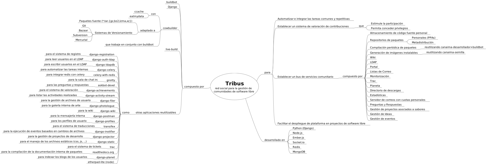

========================
Documentación conceptual
========================

Tribus está desarrollado en Python, entre otras tecnologías modernas. Desde el punto de vista técnico, es un gestor de tareas de alta capacidad que ejecuta acciones según diversos criterios (por eventos, sincronización, etc). Las tareas son programadas por los usuarios de una instancia maestra a través de una interfaz web (Django). La instancia maestra puede tener instancias esclavas en diferentes dispositivos físicos de internet, las cuales pueden ejecutar las tareas de la instancia maestra según su disponibilidad. Por ejemplo, un usuario en casa puede levantar una instancia web y configurarla como esclava de la instancia mestra de Tribus, permititendo utilizar sus recursos en las diferentes tareas.

.. image:: ../images/philosophy.svg
   :width: 500px
   :target: ../_images/philosophy.svg
   :align: center

Existen otras interfaces además de la interfaz web: la interfaz por consola (cli -- command line interface) y la interfaz gráfica (gui -- graphical user interface) contienen una serie de funciones que permiten interactuar con la instancia maestra o ejecutar tareas localmente.

Las diferentes tareas dentro de Tribus son registradas según área de conocimiento (o "Tribu"), hasta ahora se han identificado las siguientes:

* Desarrollo
* Documentación
* Traducción
* Diseño gráfico
* Activismo social

Más abajo tenemos un mapa mental que resume el diseño conceptual de la aplicación.

Luego un mapa mental que describe las funcionalidades de Tribus que son parte del diseño final de la aplicación.

A continuación se lista el diseño de los diferentes comandos y funcionalidades de Tribus. Si eres desarrollador de Tribus, deberías agregar un documento rst en la carpeta development/drafts que describa la nueva funcionalidad que estás agregando, si aplica.

.. toctree::
    :maxdepth: 1
    :glob:

    drafts/*
